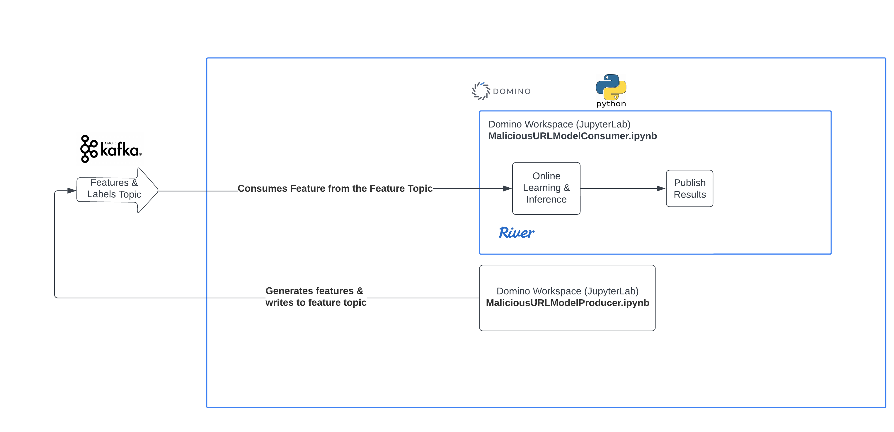

# Online Learning Deployment for Streaming Applications

This repository is the official implementation of the paper **Online Learning Deployment for Streaming Applications in the Banking Sector** (Barry, Montiel, Bifet, Wadkar, Chiky, Shakman, Manchev, Halford, El Baroudi,  ICDE 2023). The ressources can be used to set up and deploy instances of online machine learning models, to generate predictions and update the model weights on streaming data.  

> **Motivations** Our goal is to propose platform to provide a seamless bridge between data science-centric activities and data engineering activities, in a way that satisfies both the imposed production constraints in term of scalability and streaming application requirements in term of online learning. Examples of potential use cases can be anomaly and fraud detection for time-evolving data streams or real-time classification of user activities or IT or logs events. This is can be a real accelerator to gain in pro-activity for real world problems solving.

## Tools used : RIVER, Kafka & Domino Platform on AWS

> [River](https://github.com/online-ml/river) [[1]](#1) is an open-source online machine learning library written in Python which main focus is **instance-incremental
learning**, meaning that every component (estimators, transformers, performance metrics, etc.) is designed to be updated one sample at a time. We used River to continuously train and update online learning model from last data streams. 
> [KAFKA](https://kafka.apache.org/) is 
a state of the art open-source distributed
event streaming platform and we used a managed hosted Kafka ([confluent](https://www.confluent.io/). We used it as a data streams generator.

> The [Domino Platform](https://www.dominodatalab.com/) platform is implemented on top of Kubernetes, where
it spins up containers on demand for running user workloads. The containers are based on Docker images, which are fully customizable. We used Domino to host the models and run scalability tests on hig velocity data generated as streams. 

## High Level Overview 

The notebook [MaxSustainableThroughputCalculator](src/MaxSustainableThroughputCalculator.ipynb) is a way to measure
the maximum theoretical throughput if the cost of processing a messaging in the Kafka platform was zero.

### Results for Maximum Sustainable Throughtput Calculations 

We present three types of calculations -
1. Throughput for training alone - This is relevant in practice because online training occurs in a separate process when the ground truth arrives. It is used along with the features used for scoring, the score and the ground truth
2. Throughput for predictions alone - This is relevant in practice because predictions/scoring occurs on a deployed model on a stream
3. Throughput for training and prediction - This is simply to provide the maximum possible throughput we can hope to achieve if perform training and predictions in the same thread where the features, predictions are stored with the identifier for the feature (ex. Credit Card Number and Transaction Id) and the ground truth is routed to the same processing partition (Kafka Part

#### Maximum sustainable throughput for training
|    | Classifier                      |   Expected Time(ms) Per Record |   Expected Time Million Records (s) |   Expected Time Million Records (mins) |   Max Prediction Throughput (sub-second-response)  |
|---:|:--------------------------------|-------------------------------:|------------------------------------:|---------------------------------------:|---------------------------------------------------:|
|  0 | HoeffdingAdaptiveTreeClassifier |                       1.82165  |                            1821.65  |                                30.3608 |                                                549 |
|  1 | SRPClassifierHAT                |                      28.2629   |                           28262.9   |                               471.048  |                                                 35 |
|  2 | SRPClassifierNaiveBayes         |                       4.40596  |                            4405.96  |                                73.4326 |                                                227 |
|  3 | AdaptiveRandomForestClassifier  |                       0.953638 |                             953.638 |                                15.894  |                                               1049 |

#### Maximum sustainable throughput for inference
|    | Classifier                      |   Expected Time(ms) Per Record |   Expected Time Million Records (s) |   Expected Time Million Records (mins) |   Max Prediction Throughput (sub-second-response)  |
|---:|:--------------------------------|-------------------------------:|------------------------------------:|---------------------------------------:|---------------------------------------------------:|
|  0 | HoeffdingAdaptiveTreeClassifier |                       0.568018 |                             568.018 |                                9.46696 |                                               1761 |
|  1 | SRPClassifierHAT                |                       1.21962  |                            1219.62  |                               20.3269  |                                                820 |
|  2 | SRPClassifierNaiveBayes         |                       1.16247  |                            1162.47  |                               19.3745  |                                                860 |
|  3 | AdaptiveRandomForestClassifier  |                       0.199434 |                             199.434 |                                3.32389 |                                               5014 |

#### Maximum sustainable throughput for training and inference together
|    | Classifier                      |   Expected Time(ms) Per Record |   Expected Time Million Records (s) |   Expected Time Million Records (mins) |   Max Prediction Throughput (sub-second-response)  |
|---:|:--------------------------------|-------------------------------:|------------------------------------:|---------------------------------------:|---------------------------------------------------:|
|  0 | HoeffdingAdaptiveTreeClassifier |                        2.38967 |                             2389.67 |                                39.8278 |                                                418 |
|  1 | SRPClassifierHAT                |                       29.4825  |                            29482.5  |                               491.375  |                                                 34 |
|  2 | SRPClassifierNaiveBayes         |                        5.56843 |                             5568.43 |                                92.8071 |                                                180 |
|  3 | AdaptiveRandomForestClassifier  |                        1.15307 |                             1153.07 |                                19.2179 |                                                867 |

The initial demo uses the following setup

The notebook [MaliciousURLModelProducer](src/MaliciousURLModelProducer.ipynb) provides a method to push features to a
feature topic.

This cell in the notebook throttle the number of features pushed to a topic
'''
#Feature Topic
feature_topic = 'features_v4'

#flush_size and sleep_time throttle the number of feature records written to the feature topic per second
flush_size=600
sleep_time=1

#Maximum number of records processed. We use a small number 5000. But a typical size would be 100000
#In the practice, the features are arriving continuously.
max_size=5000

#Dataset used
dataset = datasets.MaliciousURL()
data = dataset.take(max_size)
'''

